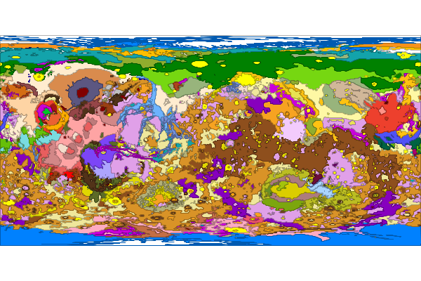
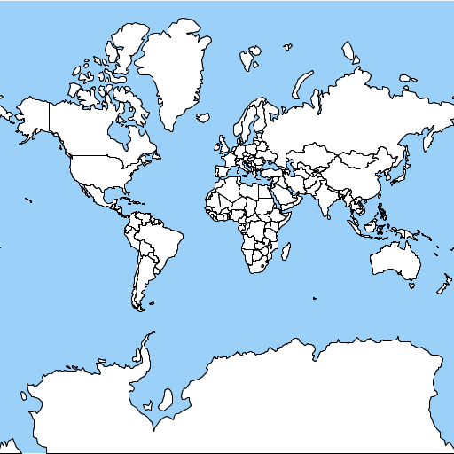
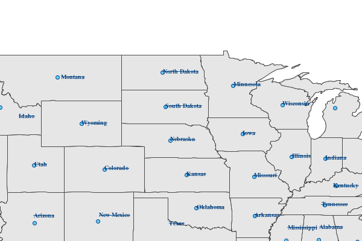
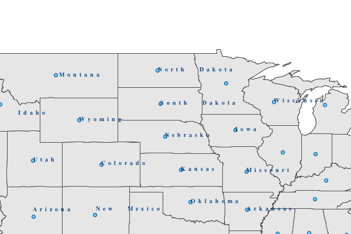
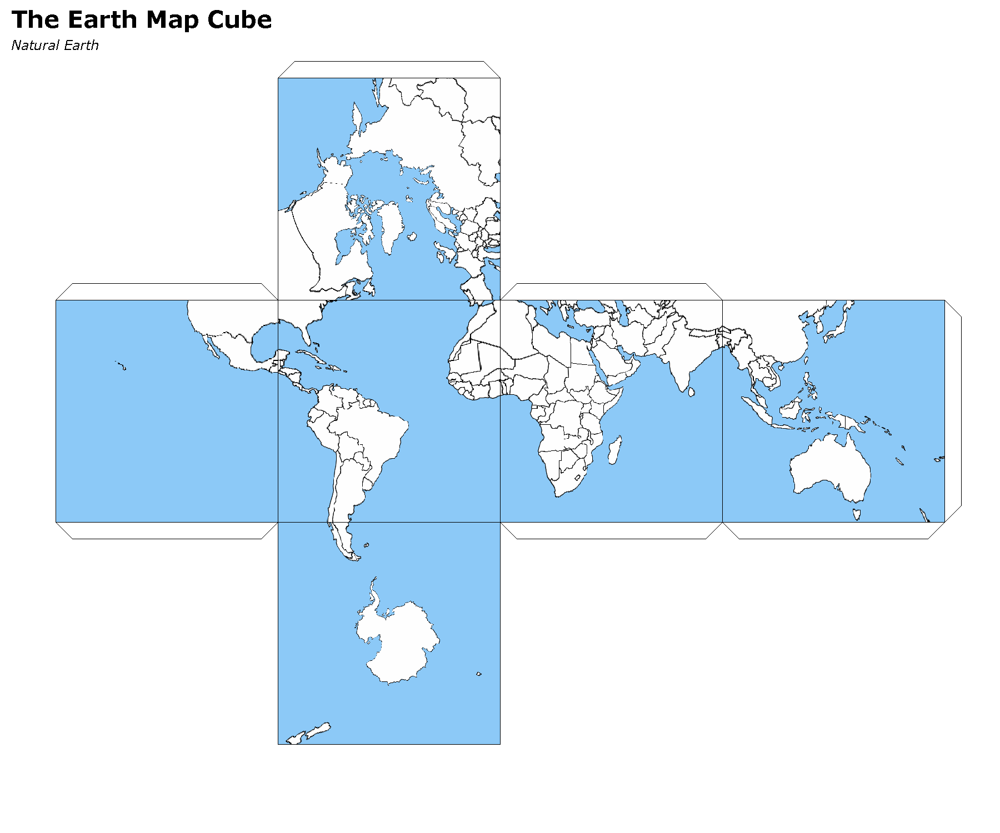
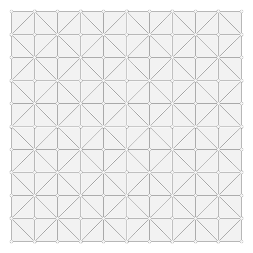
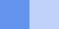
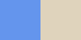

.. _releases:

GeoScript Groovy Releases
=========================

1.11-SNAPSHOT
------
The 1.11 release of GeoScript is currently under development and is built on Grooovy 2.4.12, GeoTools 19.0, and the Java Topology Suite 1.13 and
requires Java 8.

Include the gt-epsg-extension GeoTools Library to support more projections::

    Projection proj = new Projection("EPSG:104905")

Add a Filter.equals method to create a Filter where a Property equals some Literal value::

    Filter filter = Filter.equals("NAME", "Washington")

The GeoScript.unzip method now correctly unzips nested directories.

The SimpleStyleReader correctly applies stroke and fill attributes when a shape is specified::

    import geoscript.geom.*
    import geoscript.layer.Layer
    import geoscript.workspace.*
    import geoscript.feature.Schema
    import geoscript.render.Map as GMap
    import geoscript.style.io.SimpleStyleReader

    Bounds bounds = new Bounds(-180,-90,180,90,"EPSG:4326")
    MultiPoint points = Geometry.createRandomPoints(bounds.geometry, 100)

    Workspace workspace = new Memory()
    Layer layer = workspace.create(new Schema("points", [[name: "geom", type: "Point"]]))
    points.geometries.each {
        layer.add([geom: it])
    }
    layer.style = new SimpleStyleReader().read("stroke=black fill=blue shape-type=star shape-size=14")

    GMap map = new GMap(layers: [layer])
    map.renderToImage()

..image:: images/simple_style_read_shape.png

Add a UniqueValuesReader for reading text files that contain a color per value.  Very useful when styling geologic maps::

    import geoscript.layer.Layer
    import geoscript.layer.Shapefile
    import geoscript.render.Map
    import geoscript.style.io.UniqueValuesReader

    import static geoscript.GeoScript.download
    import static geoscript.GeoScript.unzip

    File dir = new File("mars")
    dir.mkdir()

    unzip(
        download(new URL("https://astropedia.astrogeology.usgs.gov/download/Mars/Geology/Mars15MGeologicGISRenovation.zip"),
                 new File(dir, "mars.zip"), overwrite: false
        )
    )

    Layer layer = new Shapefile("mars/I1802ABC_Mars_global_geology/Shapefiles/I1802ABC_Mars2000_Sphere/geo_units_oc_dd.shp")

    UniqueValuesReader styleReader = new UniqueValuesReader("UnitSymbol", "polygon")
    layer.style = styleReader.read(new File("mars/I1802ABC_Mars_global_geology/I1802ABC_geo_units_RGBlut.txt"))

    Map map = new Map(layers: [layer])
    map.render(new File("mars_geology.png"))

1.10.0
------
The 1.10.0 release of GeoScript is built on Grooovy 2.4.12, GeoTools 18.0, and the Java Topology Suite 1.13 and
requires Java 8.

A Sqlite Workspace based on the OGR non-spatialite Sqlite format::

    Sqlite sqlite = new Sqlite(new File("naturalearth"))
    Layer countries = sqlite.get("countries")
    Layer ocean = sqlite.get("ocean")

Read and Write Geometry in the GeoPackage format::

    GeoPackageReader reader = new GeoPackageReader()
    String hexString = "4750000200000000405bc00000000000405bc00000000000c047800000000000c0478000000000000000000001405bc00000000000c047800000000000"
    Point point = reader.read(hexString)
    println point 
    POINT (111 047)
    
    GeoPackageWriter writer = new GeoPackageWriter()
    Point p = new Point(111,-47)
    String hexString = writer.write(p)
    println hexString
    4750000200000000405bc00000000000405bc00000000000c047800000000000c0478000000000000000000001405bc00000000000c047800000000000
    
Store tiles in any JDBC database (like H2, Postgres, or SQLite) in the familiar MBTiles format::

    import geoscript.layer.*
    import geoscript.style.io.SimpleStyleReader
    import javax.imageio.ImageIO
    import static geoscript.GeoScript.download
    import static geoscript.GeoScript.unzip

    // Create a directory fo
    File dir = new File("dbtiles")
    dir.mkdir()

    // Download data from natural earth
    File shpDir = new File("naturalearth")
    [
            [name: "countries", url: "http://www.naturalearthdata.com/http//www.naturalearthdata.com/download/110m/cultural/ne_110m_admin_0_countries.zip"],
            [name: "ocean",     url: "http://www.naturalearthdata.com/http//www.naturalearthdata.com/download/110m/physical/ne_110m_ocean.zip"]
    ].each { Map item ->
        unzip(download(new URL(item.url), new File(shpDir, "${item.name}.zip"), overwrite: false))
    }

    // Use simple style reader to create styles
    SimpleStyleReader styleReader = new SimpleStyleReader()

    // Get Layers and their styles
    Layer ocean = new Shapefile("naturalearth/ne_110m_ocean.shp")
    ocean.style = styleReader.read("fill=#88caf8")

    Layer countries = new Shapefile("naturalearth/ne_110m_admin_0_countries.shp")
    countries.style = styleReader.read("stroke=black stroke-width=0.5 fill=white")

    // DBTiles with h2
    File file = new File("world.db")
    DBTiles dbtiles = new DBTiles("jdbc:h2:${file}","org.h2.Driver", "World", "A map of the world")

    TileRenderer renderer = new ImageTileRenderer(dbtiles, [ocean, countries])
    TileGenerator generator = new TileGenerator(verbose: true)
    generator.generate(dbtiles, renderer, 0, 4)

    (0..3).each{int zoom ->
        Raster raster = dbtiles.getRaster(dbtiles.tiles(zoom))
        ImageIO.write(raster.image, "png", new File(dir, "h2_${zoom}.png"))
    }

    dbtiles.close()

The Label Symbolizer now has a strikethrough property::

    def statesShp = new Shapefile("states.shp")
    statesShp.style = (new Fill("#E6E6E6") + new Stroke("#4C4C4C",0.5)) +
            (new Shape("#66CCff", 6, "circle").stroke("#004080") + new Transform("centroid(the_geom)")).zindex(1) +
            (new Label("STATE_NAME").strikethrough(true).font(new Font("normal", "bold", 10, "serif")).fill(new Fill("#004080")))

    def map = new Map(
        width: 600,
        height: 400,
        bounds: new Bounds(-114.675293,37.317752,-83.078613,49.210420,"EPSG:4326"),
        fixAspectRatio: true
    )
    map.proj = "EPSG:4326"
    map.addLayer(statesShp)
    map.render(new File("states_label_strikethrough.png"))

The Label Symbolizer now has wordSpacing and characterSpacing properties::

    def statesShp = new Shapefile("states.shp")
    statesShp.style = (new Fill("#E6E6E6") + new Stroke("#4C4C4C",0.5)) +
            (new Shape("#66CCff", 6, "circle").stroke("#004080") + new Transform("centroid(the_geom)")).zindex(1) +
            (new Label("STATE_NAME").wordSpacing(10).characterSpacing(5).font(new Font("normal", "bold", 10, "serif")).fill(new Fill("#004080")))

    def map = new Map(
        width: 600,
        height: 400,
        bounds: new Bounds(-114.675293,37.317752,-83.078613,49.210420,"EPSG:4326"),
        fixAspectRatio: true
    )
    map.proj = "EPSG:4326"
    map.addLayer(statesShp)
    map.render(new File("states_label_spacing.png"))

Create a map cube using the gnomonic cube sphere projection::

    MapCube mapCube = new MapCube(title: "The Earth Map Cube", source: "Natural Earth", drawOutline: true)
    mapCube.render([ocean, countries], new File("map_cube.png"))

Generate a grid with triangles::

    Bounds b = new Bounds(0,0,10,10)
    Draw.draw(b.getGrid(5,5,"triangle"), out: "triangles.png")

Several methods were added to the Color class::

    Color c = new Color("#6495ED")

Darken::

    c.darken(0.50)

Lighten::

    c.lighten(0.20)
    

Constrast::
    
    c.contrast(new Color("navy"), new Color("white"), 0.20)

.. image:: images/colors/color_contrast.png

Desaturate::

    c.desaturate(0.33)

Saturate::

    c.saturate(0.33)

Grayscale::

    c.grayscale(0.45)

Mix::

    c.mix(new Color("wheat"), 0.15)

Shade::

    c.shade(0.45)

Spin::

    c.spin(0.61)

Tint::

    c.tint(0.10)

1.9.0
-----
The 1.9.0 release of GeoScript is built on Grooovy 2.4.10, GeoTools 17.0, and the Java Topology Suite 1.13 and
requires Java 8.

Alot of work went into improving documentation.

Javadocs are now published online.

http://geoscript.github.io/geoscript-groovy/api/1.9.0/index.html

And a GeoScript Groovy Cookbook is slowly but surely adding simple recipes.

https://jericks.github.io/geoscript-groovy-cookbook/index.html

https://jericks.github.io/geoscript-groovy-cookbook/index.pdf

    The Label Symbolizer now has an underline method::

        import geoscript.layer.Shapefile
        import geoscript.render.Map
        import geoscript.style.*

        def statesShp = new Shapefile("states.shp")
        statesShp.style = (new Fill("#E6E6E6") + new Stroke("#4C4C4C",0.5)) +
                (new Shape("#66CCff", 6, "circle").stroke("#004080") + new Transform("centroid(the_geom)")).zindex(1) +
                (new Label("STATE_ABBR").underline(true).font(new Font("normal", "bold", 10, "serif")).fill(new Fill("#004080")))

        def map = new Map(width: 600, height: 400, fixAspectRatio: true)
        map.proj = "EPSG:4326"
        map.addLayer(statesShp)
        map.bounds = statesShp.bounds
        map.render(new File("states_underline.png"))

    .. image:: images/states_underline.png

    Add support for the WagnerV projection as a well known name::

        Projection proj = new Projection("WagnerV")
        println proj

    Create Colors with rgb and hsl function syntax::

        Color color1 = new Color("rgb(255,0,255)")
        Color color2 = new Color("hsl(0,1,0.5)")

    Raster can pretty print values::

        Format format = new GeoTIFF("earth.tif")
        Raster raster = format.read()
        println raster.getValuesAsString(0,0,7,5,0)

          0.100   0.450   0.193   0.200  12.456   0.200   0.000
          0.100   1.450   1.193   1.200 112.456   1.200   0.000
          0.100   1.450   2.193   3.200 212.456   1.200   0.000
          0.100   1.450   1.193   1.200 112.456   1.200   0.000
          0.100   0.450   0.193   0.200  12.456   0.200   0.000

        println raster.getValuesAsString(0,0,7,5,0, prettyPrint: true)

          -----------------------------------------------------------------------
          |   0.100 |   0.450 |   0.193 |   0.200 |  12.456 |   0.200 |   0.000 |
          -----------------------------------------------------------------------
          |   0.100 |   1.450 |   1.193 |   1.200 | 112.456 |   1.200 |   0.000 |
          -----------------------------------------------------------------------
          |   0.100 |   1.450 |   2.193 |   3.200 | 212.456 |   1.200 |   0.000 |
          -----------------------------------------------------------------------
          |   0.100 |   1.450 |   1.193 |   1.200 | 112.456 |   1.200 |   0.000 |
          -----------------------------------------------------------------------
          |   0.100 |   0.450 |   0.193 |   0.200 |  12.456 |   0.200 |   0.000 |
          -----------------------------------------------------------------------

    SLDWriter has optional named parameters for the number of spaces to use while indenting and
    whether to export default values or not::

        Symbolizer sym = new Fill("wheat") + new Stroke("brown")
        SLDWriter writer = new SLDWriter()
        String sld = writer.write(sym, exportDefaultValues: true, indentation: 4)
        println sld

        <?xml version="1.0" encoding="UTF-8"?>
        <sld:StyledLayerDescriptor xmlns="http://www.opengis.net/sld" xmlns:sld="http://www.opengis.net/sld" xmlns:ogc="http://www.opengis.net/ogc" xmlns:gml="http://www.opengis.net/gml" version="1.0.0">
            <sld:UserLayer>
                <sld:LayerFeatureConstraints>
                    <sld:FeatureTypeConstraint/>
                </sld:LayerFeatureConstraints>
                <sld:UserStyle>
                    <sld:Name>Default Styler</sld:Name>
                    <sld:FeatureTypeStyle>
                        <sld:Name>name</sld:Name>
                        <sld:Rule>
                            <sld:PolygonSymbolizer>
                                <sld:Fill>
                                    <sld:CssParameter name="fill">#f5deb3</sld:CssParameter>
                                    <sld:CssParameter name="fill-opacity">1.0</sld:CssParameter>
                                </sld:Fill>
                            </sld:PolygonSymbolizer>
                            <sld:LineSymbolizer>
                                <sld:Stroke>
                                    <sld:CssParameter name="stroke">#a52a2a</sld:CssParameter>
                                    <sld:CssParameter name="stroke-linecap">butt</sld:CssParameter>
                                    <sld:CssParameter name="stroke-linejoin">miter</sld:CssParameter>
                                    <sld:CssParameter name="stroke-opacity">1.0</sld:CssParameter>
                                    <sld:CssParameter name="stroke-width">1</sld:CssParameter>
                                    <sld:CssParameter name="stroke-dashoffset">0.0</sld:CssParameter>
                                </sld:Stroke>
                            </sld:LineSymbolizer>
                        </sld:Rule>
                    </sld:FeatureTypeStyle>
                </sld:UserStyle>
            </sld:UserLayer>
        </sld:StyledLayerDescriptor>

1.8.0
-----
The 1.8.0 release of GeoScript is built on Grooovy 2.4.7, GeoTools 16.0, and the Java Topology Suite 1.13 and
requires Java 8.

    Create Projections using well known names::

        new Projection("WGS84")
        new Projection("Mollweide")
        new Projection("WagnerIV")
        new Projection("WorldVanderGrintenI")
    
    Create a Raster from Tiles around a Point::
    
        Raster raster = osm.getRaster(
            Projection.transform(Geometry.fromWKT(wkt), "EPSG:4326", "EPSG:3857") as Point, 
            z, 
            400, 
            400
        )

    Create a Directory Workspace from a zipped shapefile URL::
    
        Directory dir = Directory.fromURL(
          new URL("http://www.naturalearthdata.com/http//www.naturalearthdata.com/download/110m/cultural/ne_110m_admin_0_countries.zip"),
          new File("naturalearth")
        )
        
    Added a getTileCoordinates() method to the Pyramid class::
    
        Pyramid pyramid = Pyramid.createGlobalMercatorPyramid()
        Bounds b = new Bounds(
            -124.73142200000001, 
            24.955967, 
            -66.969849, 
            49.371735, 
            "EPSG:4326"
        ).reproject("EPSG:3857")
        Map coords = pyramid.getTileCoordinates(b, pyramid.grid(4))
        
    Added getDataSource() method to the Database Workspace.
    
    Added Stamen's Terrain layer to the OSM.getWellKnownOSM() method::
    
        TileLayer.getTileLayer([type: 'osm', name: 'stamen-terrain'])
        
    GeoPackage.delete() method removes a GeoPackage Tile Layer.
    
    Added Filter.id() and Filter.ids() methods::
    
        Filter filter = Filter.id("points.1")
        Filter filter = Filter.ids(["points.1","points.2","points.3"])

    Added XmlSchemaReader and XmlSchemaWriter::
    
        String str = """<schema>
            <name>points</name>
            <projection>EPSG:4326</projection>
            <geometry>geom</geometry>
            <fields>
            <field>
              <name>geom</name>
              <type>Point</type>
              <projection>EPSG:4326</projection>
            </field>
            <field>
              <name>name</name>
              <type>String</type>
            </field>
            <field>
              <name>price</name>
              <type>Float</type>
            </field>
            </fields>
            </schema>"""
        SchemaReader reader = new XmlSchemaReader()
        Schema schema = reader.read(str)

    Fixed Raster.eachCell so it visits every cell.
    
    Added normalize and convolve methods to Raster.
    
    Added getMinZoom() and getMaxZoom() methods to GeoPackage TileLayer.

1.7.0
-----
    The 1.7.0 release of GeoScript is built on Grooovy 2.4.6, GeoTools 15.0, and the Java Topology Suite 1.13 and
    requires Java 8.

    This version focused on making GeoScript more modular and extensible.  GeoScript is more extensible by
    providing Service Provider Interface (SPI) end points for Readers, Writer, Formats, TileLayers and Workspaces.
    GeoScript is more modular by using Groovy's Extension Modules to add methods dynamically.

    Most of the other features of 1.7 were contributed by the community (thank you sbortman, blackrez, and gnafu)
    or driven by the development of `geoc <https://github.com/jericks/geoc>`_ (a geospatial commandline application),
    `geo-shell <https://github.com/jericks/geo-shell>`_ (an interactive shell for geospatial analysis),
    and `MBTilesServer <https://github.com/jericks/MBTilesServer>`_ (a Spring Boot based web app for serving
    MBtiles maps).

    **Tile**

    MBTiles got methods to access metdata and minimum and maximum zoom levels::

        MBTiles layer = new MBTiles(new File("states.mbtiles"))
        println layer.metadata
        println layer.minZoom
        println layer.maxZoom

    GeoPackage and MBTiles both got a new getTileCount() method that returns statistics on the number of tiles present
    per zoom level::

        GeoPackage layer = new GeoPackage(new File("states.gpkg"), "states")
        List stats = layer.tileCounts
        stats.eachWithIndex { Map stat, int index ->
            println "${index}). ${stat.zoom} ${stat.tiles} ${stat.total} ${stat.percent}"
        }

    The Tile module got a new TileLayer called GeneratingTileLayer that can generate Tiles on demand::

        Layer layer = new Shapefile("states.shp")
        layer.style = new Fill("wheat") + new Stroke("navy", 0.1)
        File file = folder.newFile("states.mbtiles")
        TileLayer tileLayer = new MBTiles(new File("states.mbtiles"), "states", "A map of the united states")
        ImageTileRenderer tileRenderer = new ImageTileRenderer(tileLayer, layer)
        GeneratingTileLayer generatingTileLayer = new GeneratingTileLayer(tileLayer, tileRenderer)

    The ImageTileLayer base class now makes sure that the Bounds passed to the getRaster() method
    is in the correct projection.

    Finally, the OSM TileLayer has a static method for creating TileLayers with well known OSM based web serivces::

        OSM.getWellKnownOSM("osm")
        OSM.getWellKnownOSM("stamen-toner")
        OSM.getWellKnownOSM("stamen-toner")
        OSM.getWellKnownOSM("stamen-toner-lite")
        OSM.getWellKnownOSM("stamen-watercolor")
        OSM.getWellKnownOSM("mapquest-street")
        OSM.getWellKnownOSM("mapquest-satellite")

    **Style**

    The Style module added a YSLD Reader and Writer::

        Symbolizer sym = new Fill("wheat") + new Stroke("brown")
        YSLDWriter writer = new YSLDWriter()
        String yaml = writer.write(sym)

    The Style module also got a new SimpleStyleReader that can easily create simple styles::

        SimpleStyleReader styleReader = new SimpleStyleReader()
        // Fill and Stroke
        Style style = styleReader.read("fill=#555555 fill-opacity=0.6 stroke=#555555 stroke-width=0.5")
        // Shape with Fill and Stroke
        style = styleReader.read("fill=navy stroke=yellow shape-type=circle")
        // Shape with Fill and Stroke with Label
        style = styleReader.read("fill=#554466 stroke=255,255,0 shape-type=triangle label=NAME label-size=12")
        // Just fill
        style = styleReader.read("fill=#554466")
        // Just stroke
        style = styleReader.read("stroke=#554466")
        // Just shape
        style = styleReader.read("shape=#554466")

    This version also updated default style and inherited a perpendicular offset for Strokes from the GeoTools project.

    **Renderer**

    sbortman added a new GeoTIFF Renderer::

        Layer layer = new Shapefile(new File("states.shp"))
        layer.style = new Stroke('black', 0.1) + new Fill('gray', 0.75)
        Map map = new Map(layers: [layer], backgroundColor: "white")
        GeoTIFF geotiff = new GeoTIFF()
        def img = geotiff.render(map)

    Users can now configure MapWindow and Window's do when the ui is closed (hide, exit, dispose)::

        Map map = new Map(layers:[new Shapefile("states.shp")])
        Window window = new Window()
        window.display(map, close: 'hide')

    The Map now guards against null projections in Bounds.

    **Geometry**

    The Geometry IO package received a Google Polygon Encoder::

        GooglePolylineEncoder encoder = new GooglePolylineEncoder()
        LineString lineString = new LineString([-120.2, 38.5], [-120.95, 40.7], [-126.453, 43.252])
        String str = encoder.write(lineString)

    The Bounds expand method is now more robust.

    An offset method was added to the Geometry class::

        Geometry g = Geometry.fromWKT("LINESTRING (0 5, 5 5)").offset(2)

    **IO**

    Several optional parameters were added to the Feature GeoJSON Writer to control the number of decimals and how
    to encode feature bounds, feature collection bounds, feature collection crs, feature crs, and whether to encode
    null values.

    The CSVReader can handle multiple geometry types.

    The GeoScript.zip method now includes nested directories and GeoScript.unzip creates directories if necessary.

    **Workspace**

    Workspaces have much better connection string and maps which are useful for command line applications::

        Workspace w = Workspace.getWorkspace("dbtype=postgis database=postgres host=localhost port=5432 user=postgres passwd=postgres")

        Workspace w = Workspace.getWorkspace("database=layers.gpkg dbtype=geopkg user=me passwd=s$cr$t")

    Users of the OGR Workspace can now use the static setErrorHandler(quiet, logging, or default) method to control OGR's logging::

        OGR.setErrorHandler("quiet")

    All workspaces now include a Workspace.remove(String name) method that can remove a Layer from the Workspace.

    The Shapefile module inherited a Shapefile.dump(File,Layer) method from GeoTools::

        Directory workspace = Shapefile.dump(dir, layer)

    Shapefile and Property layers can look up side car SLD or CSS files.

    The Property Workspace got a getFile() method.

    The WFS Workspace can optionally take user and password parameters.

1.6.0
-----

    The 1.6.0 release of GeoScript is built on Groovy 2.4.4, GeoTools 14.0, and the Java Topology Suite 1.13.

    Significant new features include support for Geobuf, a OGR Workspace, and improvements to the Tile module.

    **GeoHash**

    GeoHash support was ported from the excellent node-geohash module.  It supports encoded and decoding Points and Bounds.::

        GeoHash geohash = new GeoHash()
        geohash.encode(new Point(112.5584, 37.8324))
        >>> "ww8p1r4t8"

        geohash.encodeLong(new Point(112.5584, 37.8324))
        >>> 4064984913515641

        Bounds bounds = geohash.decodeBounds("ww8p1r4t8")
        >>> "(112.55836486816406,37.83236503601074,112.5584077835083,37.83240795135498)"

    **Geobuf**

    Geobuf is an emerging new format from MapBox.  GeoScript support for Geobuf includes a Workspace and Geometry, Feature, and Layer
    readers and writers::

        File directory = new File("data")
        Geobuf geobuf = new Geobuf(directory)

        // Create an in memory Layer
        Memory memory = new Memory()
        Layer memoryLayer = memory.create('locations',[new Field("geom", "Point"), new Field("name", "String")])
        memoryLayer.add([new Point(1,1), "Seattle"])
        memoryLayer.add([new Point(2,2), "Portland"])
        memoryLayer.add([new Point(3,3), "Tacoma"])

        // And add it to Geobuf
        geobuf.add(memoryLayer)

        GeobufWriter writer = new GeobufWriter()
        Schema schema = new Schema("houses", [new Field("geom","Point"), new Field("name","string"), new Field("price","float")])
        Feature feature = new Feature([new Point(111,-47), "House", 12.5], "house1", schema)
        String hex = writer.write(feature)
        >>> "0a046e616d650a057072696365100218062a1f0a0c08001a0880e7ed69ffa6e92c6a070a05486f7573656a060a0431322e35"

    **Workspace**

    In addition to the new Geobuf Workspace, a OGR Workspace was also added.  This requires the GDAL/OGR native library
    to be installed with Java/JNI support.::

        File shpFile = new File("states.shp")
        Layer shpLayer = new Shapefile(shpFile)

        File file = new File("states.sqlite")
        OGR ogr = new OGR("SQLite", file.absolutePath)
        Layer layer = ogr.create(shpLayer.cursor, options: [
            "SPATIALITE=YES"
        ])

    WFS support upgraded to the new WFS-NG library.  Major thanks to Scottie and Neils who helped trouble shoot.

    **Geometry**

    The Geometry module some small improvements. A LineString.close() method creates a LinearRing.  The GeometryCollection.narrow() method
    returns the most specific geometry type possible.  If all geometries are Points, narrow will return a MultiPoint.  Finally,
    The Bounds.getCorners() returns a list of the 4 corners as Points.

    **Layer**

    The major improvement to the Layer module is the wrapping of the GeoTools gt-grid module in a Graticule class that makes creating
    graticule based vector grids extremely easy.::

        Layer layer = Graticule.createSquares(new Bounds(110.0, -45.0, 160.0, -5.0, "EPSG:4326"), 10, -1)

        File dir = new File("squares")
        Workspace workspace = new Directory(dir)
        Layer layer = Graticule.createSquares(new Bounds(110.0, -45.0, 160.0, -5.0, "EPSG:4326"), 10, 1,
            workspace: workspace, layer: "squares")

        Schema schema = new Schema("hexagon", [
            new Field("geom", "Polygon"),
            new Field("color", "java.awt.Color")
        ])
        Bounds b = new Bounds(0,0,100,100)
        Layer layer = Graticule.createHexagons(b, 5.0, -1.0, "flat", schema: schema, setAttributes: { GridElement e, Map attributes ->
            int green = (255 * e.center.x / b.width)  as int
            int blue  = (255 * e.center.y / b.height) as int
            attributes["color"] = new Color(0, green, blue)
        })

    **Raster**

    The Raster module saw some minor improvements. A Format.has(String name) checks to see if a Raster by that name exists.
    A few more Raster functions were added: log, exp, and absolute.  Finally, this version adds support for file names and
    String urls when loading Rasters using the Format.getFormat() method.

    **Tile**

    The Tile module continued to improve with help from gpotts.

        * gpotts fixed a bug that assumed all Tile Grids started at 0

        * You can now delete tiles from a TileLayer::

            GeoPackage layer = new GeoPackage(newFile, "states")
            Tile tile = layer.get(4, 2, 3)
            layer.delete(tile)

        * The TileGenerator has an option to only generate missing tiles::

            TileGenerator generator = new TileGenerator()
            generator.generate(mbtiles, renderer, 0, 2, missingOnly: true)

        * TileLayer can now be loaded from a connection parameter string (which is very useful for command line apps)::

            TileLayer tileLayer = TileLayer.getTileLayer("type=mbtiles file=states.mbtiles")

            TileLayer tileLayer = TileLayer.getTileLayer("type=tms file=/Users/geoscript/tiles format=jpeg")

            TileLayer tileLayer = TileLayer.getTileLayer("type=vectortiles file=vectortilesdir format=mvt pyramid=GlobalMercator")

        * The TileLayer.getTileRenderer() static method returns a default TileRenderer for the given TileLayer.

        * PBF Vector Tiles now check for empty sub fields.

        * MVT support was rewritten to avoid creating huge empty byte buffers, support for dates was added, and the reader and write can round trip.

        * Pyramid readers and writers were added.  Formats include gdal tms mini driver xml fiels, xml, and json.

        * The Grid class now has min and max methods.

        * Pyramid support now supports geodetic, mercator, and global geodetic as well known names and Pyramid hash a static createGlobalGeodeticPyramid() method.

    **Color**

    The Color module includes support for custom palettes in addition to color brewer.

    **Map**

    The Map and rendering modules inherits awesome improvements from GeoTools including dash an an expression and single and multiple layer z ordering.

1.5.0
-----

    The 1.5.0 release of GeoScript is built on Groovy 2.3.10, GeoTools 13.0, and the Java Topology Suite 1.13.

    In addition to bug fixes, there are significant improvements to the GeoPackage Workspace and TileLayer,
    and the tile module in general including support for generating and consuming vector tiles.  GeoScript switched
    to the Java based CSS module and includes composite and blending support.
    
    **Tiles**
    
        Vector Tile support includes geojson, mvt, pbf::

            File dir = new File("states_vector_tiles_pbf")
            Pyramid pyramid = Pyramid.createGlobalMercatorPyramid(origin: Pyramid.Origin.TOP_LEFT)
            VectorTiles vectorTiles = new VectorTiles(
                "states",
                dir,
                pyramid,
                "pbf",
                style: [
                    "states": new Fill("wheat"),
                    "states_centroids": new Shape("red",12,"circle")
                ]
            )

            Layer layer = new Shapefile("states.shp")
            Layer centroidLayer = layer.transform("states_centroids", [
                "geom": "centroid(the_geom)",
                "name": "STATE_NAME"
            ])

            PbfVectorTileRenderer renderer = new PbfVectorTileRenderer([layer, centroidLayer], [
                    "states": ["STATE_NAME"],
                    "states_centroids": ["name"]
            ])
            TileGenerator generator = new TileGenerator(verbose: true)
            generator.generate(vectorTiles, renderer, 0, 6)

        The GeoPackage Tile origin is TOP LEFT not BOTTOM LEFT.
        
        Pyramid.createGlobalMercatorPyramid can take named parameter origin::

            Pyramid pyramid = Pyramid.createGlobalMercatorPyramid(origin: Pyramid.Origin.TOP_LEFT)
        
        TileCursor validates z values

        TileCursor guards against empty bounds
            
        TileCursor getEmpty method    
            
        An empty TileCursor return a blank raster
        
        TileGenerate can now generate tiles that intersect a bounds::

            TileGenerator generator = new TileGenerator(verbose: true)
            generator.generate(layer, renderer, 0, 6, bounds: new Bounds(0,0,45,45))
        
        Fixed bounds bug in Pyramid
        
        Fixed Grid size exceeding precision
                
    **Geometry**
        
        Bounds intersection keeps projection
    
        Bounds string can include Projection::

            Bounds bounds = Bounds.fromString("0,0,10,10,EPSG:4326")
        
        WktReader can read EWKT with SRID prefixes::

            WktReader reader = new WktReader()
            Point pt = reader.read("SRID=4326;POINT (111 -47)")
        
        Added missing Geometry.getDimension() method::

            Geometry.fromWKT("POINT (1 1)").dimension
            >>> 0
            Geometry.fromWKT("LINESTRING (1 1, 10 10)").dimension
            >>> 1
            Geometry.fromWKT("POLYGON ((90 90, 90 110, 110 110, 110 90, 90 90))").dimension
            >>> 2
        
    **Projection**
    
        Added Projection.getSrs() method::

            Projection p = new Projection("urn:ogc:def:crs:EPSG::4326")
            println p.srs
            >>> "urn:ogc:def:crs:EPSG::4326"
            println p.getSrs(true)
            >>> "4326"
    
    **Style**
    
        CSS reader uses Java version instead of Scala version
    
        Document ColorMap's opacity and label properties

        Shape Symbolizer support anchor and displacement properties::

            Shape shape = new Shape(color:  "blue",  size: 6, type: "square", anchorPoint: [0.2, 0.7], displacement: [0.45, 0.55])

        Composite and Blending support were added to the Style API::

            Layer shp = new Shapefile("states.shp")
            Function func = new Function("Recode(SUB_REGION,'N Eng','#6495ED','Mid Atl','#B0C4DE','S Atl','#00FFFF',
                'E N Cen','#9ACD32','E S Cen','#00FA9A','W N Cen','#FFF8DC','W S Cen','#F5DEB3','Mtn','#F4A460','Pacific','#87CEEB')")
            shp.style = (new Fill(func).composite("multiply", symbolizer: false, base: true)).zindex(1) +
                (new Stroke("black", 10).composite("destination-in", symbolizer: false)).zindex(2) +
                (new Stroke("#999999", 0.1) + new Label("STATE_ABBR").point([0.5, 0.5])).zindex(3)

            Map map = new Map(
                layers: [shp],
                backgroundColor: "white"
            )
            map.render(new File("style_composite.png"))

        .. image:: images/style_composite.png
    
    **Workspace** 
    
        GeoPackage Workspace Layers are now compatible with GDAL/OGR, QGIS, and ArcMap.
    
        To make sure that Workspaces are closed you can use the new Workspace.withWorkspace(Workspace, Closure) idiom::

            Workspace.withWorkspace(new H2(folder.newFile("roads.db").absolutePath)) { Workspace w ->
                // Use the Workspace here
            }

    **Layer**
    
        The Shapefile Layers gets zip and unzip methods::

            Shapefile shp = new Shapefile(new File(dir, "states.shp"))

            // Zip the Shapefile's files
            File zipFile = shp.zip()

            // Unzip
            Shapefile shp2 = Shapefile.unzip(zipFile)

        Remove new lines from content in CsvWriter
        
        Fixed a bug with Groovy and Layer.reproject
        
        The Schema class gets a getSpec() method::

            Schema schema = new Schema("widgets", [
                new Field("geom","Point"),
                new Field("name","string"),
                new Field("price","float")
            ])
            println schema.spec
            >>> "geom:Point,name:String,price:Float"

    **Raster**
    
        Format.getFormat() accepts inputs besides file
    
        The Raster class has a new extractFootPrint() method::

            File file = new File("raster.tif")
            GeoTIFF geoTIFF = new GeoTIFF(file)
            Raster raster = geoTIFF.read()
            Layer layer = raster.extractFootPrint()
      
    **Rendering**
    
        ASCII Map Renderer::

            Layer layer = new Shapefile(new File("states.shp"))
            layer.style = new Stroke('black', 0.1) + new Fill('gray', 0.75)
            Map map = new Map(layers: [layer], backgroundColor: "white")
            ASCII renderer = new ASCII(width: 50)

        Here is the output::

            ..................................................
            ..................................................
            ..................................................
            ..................................................
            ..................................................
            ..................................................
            ..)))))$))))))))))))))))))........................
            ))))))))))))))))))))))))))))))....................
            +)))))))))))))))))))))))))))))))-):............)).
            .))))))))$))))))))))))))))))))))^.))..........-))+
            :)))))))))))))))))))))))))))$))).)))......)):)$)..
            ))))))))))))))))))+****))))))))).))))...))))*))...
            )))))))))))))))))))))))))))))))).)))..)))))))))...
            )))))))))))))-))))))))))))))))))))$))))))))):.....
            .))))))))))))+))))))))))))))))))))*))))+%)$+......
            .))))))))))))+))))))))))))))))))))))%)))))).......
            ..)))))))))))+))))))))))))))))$)))))*))))*........
            ...))))))))))$))))))))))))))))))))))%)))):?.......
            ...:)))))))))$))))))))))))))))))))))))+)))........
            ......)))))))$)))))))))))))))))-))))))))..........
            ......-.*))))$))))))))))))$)))))))))))!...........
            ............:$..)))))))))))))))))))))*............
            .................)))))))))))))!..:)))^............
            ..................-..)))))..........))............
            .....................)))............%)............
            ......................)).............))...........
            ..................................................
            ..................................................
            ..................................................
            ..................................................
            ..................................................
            ..................................................
            ..................................................

    **Development**
        
        Started using `Travis CI <https://travis-ci.org/geoscript/geoscript-groovy>`_

1.4.0
-----

    The 1.4 release of GeoScript is built on Groovy 2.2, GeoTools 12, and the Java Topology Suite 1.13.

    In addition to many bug fixes and performance improvements, the major new features include a tile module,
    GeoPackage support, curved geometry types, and quick start docs for maven and gradle.

    **Tile Module**

        The tile module provides simple ways to consume and create tiled maps.

        Supported tiled formats include:

            * MBTiles

            * GeoPackage

            * UTFGrid

            * TMS

            * OSM

        You can create tiles in MBTiles, GeoPackage, TMS, or OSM formats::

            Shapefile shp = new Shapefile(new File("states.shp"))
            shp.style = new Fill("wheat") + new Stroke("navy", 0.1)

            File file = new File("states.mbtiles")
            MBTiles mbtiles = new MBTiles(file, "states", "A map of the united states")

            TileRenderer renderer = new ImageTileRenderer(mbtiles, shp)
            TileGenerator generator = new TileGenerator(verbose: true)
            generator.generate(mbtiles, renderer, 0, 4)

        You can then use these tile sets to extract Rasters or as base maps when rendering::

            OSM osm = new OSM("Stamen Terrain", [
                "http://a.tile.stamen.com/terrain",
                "http://b.tile.stamen.com/terrain",
                "http://c.tile.stamen.com/terrain",
                "http://d.tile.stamen.com/terrain"
            ])

            Shapefile shp = new Shapefile("states.shp")
            ["North Dakota", "Oregon", "Washington"].each { String name ->
                shp.getFeatures("STATE_NAME = '${name}'").each { Feature f ->
                    Bounds b = f.geom.bounds.expandBy(0.5)
                    b.proj = "EPSG:4326"
                    Raster raster = osm.getRaster(b.reproject("EPSG:3857"), 400, 400)
                    ImageIO.write(raster.image, "png", new File("images", "${name}.png"))
                }
            }

    **GeoPackage**

        GeoPackage support includes a Workspace (geoscript.workspace.GeoPackage) for vector features::

            Workspace geopkg = new GeoPackage(folder.newFile("geopkg.gpkg"))
            try {
                // Get the States Shapefile
                File file = new File(getClass().getClassLoader().getResource("states.shp").toURI())
                Shapefile shp = new Shapefile(file)

                // Add states shapefile to the GeoPackage database
                Layer l = geopkg.add(shp, 'states')
                geopkg.get('states').eachFeature { Feature f ->
                    println "${f['STATE_NAME']} at ${f.geom}"
                }

                // Add the centroids of each state to the GeoPackage database
                Layer l2 = geopkg.add(shp.transform("state_centroids", [
                        geom: "centroid(the_geom)",
                        abbr: "STATE_ABBR",
                        name: "STATE_NAME"
                ]))
                geopkg.get('state_centroids').eachFeature { Feature f ->
                    println "${f['STATE_NAME']} at ${f.geom}"
                }
            } finally {
                geopkg.close()
            }

        And a TileLayer (geoscript.layer.GeoPackage) for tiled layers::

            Shapefile shp = new Shapefile(new File("states.shp"))
            shp.style = new Fill("wheat") + new Stroke("navy", 0.1)

            File file = new File("states.mbtiles")
            GeoPackage gpkg = new GeoPackage(file, "states", Pyramid.createGlobalMercatorPyramid())

            TileRenderer renderer = new ImageTileRenderer(gpkg, shp)
            TileGenerator generator = new TileGenerator(verbose: true)
            generator.generate(gpkg, renderer, 0, 4)

    **Curved Geometries**

        * CircularString::

            CircularString cs = new CircularString(
                new Point(6.12, 10.0),
                new Point(7.07, 7.07),
                new Point(10.0, 0.0)
            )

        * CircularRing::

            CircularRing cr = new CircularRing(
                new Point(2, 1),
                new Point(1, 2),
                new Point(0, 1),
                new Point(1, 0),
                new Point(2, 1)
            )

        * CompoundCurve::

            CompoundCurve cc = new CompoundCurve(
                new CircularString([10.0, 10.0], [0.0, 20.0], [-10.0, 10.0]),
                new LineString([-10.0, 10.0], [-10.0, 0.0], [10.0, 0.0], [5.0, 5.0])
            )

        * CompoundRing::

            CompoundRing cc = new CompoundRing(
                new CircularString([10.0, 10.0], [0.0, 20.0], [-10.0, 10.0]),
                new LineString([-10.0, 10.0], [-10.0, 0.0], [10.0, 0.0], [10.0, 10.0])
            )

    **Quick start docs**

        * **Maven** Create a simple app using Maven

        * **Maven Web App with JNDI** Create a web app with Maven using JNDI

        * **Gradle** Create a simple app using Gradle

    **API Updates**

        * Workspace.has(String name)::

            Workspace workspace = new Memory()
            if (!workspace.has("points")) {
                workspace.create("points", [["the_geom", "Point", "EPSG:4326"]])
            }

        * Raster.selectBands(List<Integer> bands, int visibleBand = -1)::

            File file = new File("alki.tif")
            GeoTIFF geoTIFF = new GeoTIFF(file)
            Raster raster = geoTIFF.read()
            Raster rbRaster = raster.selectBands([0,2], 2)

        * Raster.transform(Map options = [:])::

            File file = new File("raster.tif")
            GeoTIFF geoTIFF = new GeoTIFF(file)
            Raster raster = geoTIFF.read()

            // Scale
            Raster scaledRaster = raster.transform(scalex: 2.5, scaley: 1.3)

            // Shear
            Raster shearRaster = raster.transform(shearx: 1.5, sheary: 1.1)

            // Translate
            Raster translatedRaster = raster.transform(translatex: 10.1, translatey: 12.6)

            // Combo
            Raster transformedRaster = raster.transform(
                    scalex: 1.1, scaley: 2.1,
                    shearx: 0.4, sheary: 0.3,
                    translatex: 10.1, translatey: 12.6,
                    nodata: [-255],
                    interpolation: "NEAREST"
            )

        * Projection.getEpsg()::

            Projection p = new Projection("EPSG:2927")
            int epsg = p.epsg

        * Added advanced projection handling and continous map wrapping to the Map Renderer::

            import geoscript.layer.*
            import geoscript.render.*
            import geoscript.style.*
            import geoscript.geom.*

            Shapefile layer = new Shapefile(new File("110m_admin_0_countries.shp"))
            layer.style = new Stroke("#eee", 0.1) + new Fill("#666")
            File file = new File("world.png")

            Map map = new Map(
                layers: [layer],
                width: 700,
                height: 200,
                backgroundColor: "blue",
                proj: "EPSG:4326",
                bounds: new Bounds(-180,-90,180,90,"EPSG:4326")
            )

            map.render(file)

        .. image:: images/world.png

        * Base64 Renderer::

            Layer layer = new Shapefile(new File("states.shp"))
            layer.style = new Stroke('black', 0.1) + new Fill('gray', 0.75)
            Map map = new Map(layers: [layer], backgroundColor: "white")
            Base64 base64 = new Base64()
            String str = base64.render(map)

        * Moved static Writer variables inside methods

        * Fixed performance problem with writing Layers to GeoRSS feeds due Proj.getId() being realllllly slow

        * Added ImageAssert tests

        * Workspace.getParametersFromString can now handle spatialite database files

        * Removed deprecated raster methods

        * Removed deprecated addSqlView methods from Database Workspace

1.3.1
-----

    The 1.3.1 release of GeoScript is built on Groovy 2.1.9, GeoTools 11.2, and the Java Topology Suite 1.13.  It contains a few minor bug fixes and performance improvements.

    * Fixed a bug with Layer.first() call if there are no features

    * Added Projection.getEpsg() method

    * Fixed bug with JPEG renderer

    * Added Image.getImageType() method

    * Improved performance of the Layer GeoRSS writer

    * Added Base64 renderer

    * Moved static io reader/writers to instance variables

1.3
---

    The 1.3 release of GeoScript is built on Groovy 2.1.9, GeoTools 11.0, and the Java Topology Suite 1.13.

    **Layer Geoprocessing and Layer Algebra**

        * **Layer Geoprocessing**

            * Split by Field

              Split a Layer into multiple Layers using the value of a Field::

                Memory workspace = new Memory()
                layer.split(layer.schema.get("col"), workspace)

            * Split by Layer

              Split a Layer into multiple Layers based on the Features from the split Layer::

                Memory workspace = new Memory()
                layer.split(splitLayer,splitLayer.schema.get("row_col"),workspace)

            * Buffer

              Buffer all of the Features in the Layer.  The buffer distance can be a geoscript.filter.Expression or a double.
              This allows variable distance buffers that depend on the value of a Field, a Function, or an Expression::

                layer.buffer(2)

                layer.buffer(new geoscript.filter.Property("col"))

                layer.buffer(geoscript.filter.Expression.fromCQL("col * 2"))

                layer.buffer(new geoscript.filter.Function("calc_buffer(row,col)", {row, col -> row + col}))

            * Merge

              Merge a Layer with another Layer to create an output Layer.

            * Dissolve

              Dissolve the Features of a Layer by a Field or dissolve intersecting Features of a Layer.

        * **Layer Algebra**

          The layer algebra methods were inspired by similar work done by the GDAL developers. The following
          examples use the GDAL dataset.

            .. image:: images/la_layers.png

            * clip::

                layerA.clip(layerB)

              .. image:: images/la_clip_a_b.png

            * union::

                layerA.union(layerB)

              .. image:: images/la_union.png

            * intersection::

                layerA.intersection(layerB)

              .. image:: images/la_intersection.png

            * erase::

                layerA.erase(layerB)

              .. image:: images/la_erase_a_b.png

            * identify::

                layerA.identity(layerB)

              .. image:: images/la_identity_a_b.png

            * update::

                layerA.update(layerB)

              .. image:: images/la_update_a_b.png

            * symDifference::

                layerA.symDifference(layerB)

              .. image:: images/la_symdifference.png

    **Add batches of Features to a Layer**

        * The geoscript.layer.Writer class adds batches of Features to a Layer with a Transaction::

            Writer writer = new Writer(layer, batch: 1000, transaction: 'default')
            try {
                Feature f = writer.newFeature
                writer.add(f)
            } finally {
                writer.close()
            }

            Writer writer = Writer.write(layer, batch: batch) { writer ->
                pts.eachWithIndex{Point pt, int i ->
                    Feature f = writer.newFeature
                    f.geom = pt
                    f['id'] = i
                    writer.add(f)
                }
            }

        * GeoScript Layers have a getWriter() and withWriter() methods::

            Writer writer = layer.getWriter(autoCommit: false, batch: 75)
            try {
                pts.eachWithIndex{Point pt, int i ->
                    writer.add(s.feature([the_geom: pt, id: i], "point${i}"))
                }
            } finally {
                writer.close()
            }

            layer.withWriter(batch: 45) {Writer writer ->
                pts.eachWithIndex{Point pt, int i ->
                    writer.add(s.feature([the_geom: pt, id: i], "point${i}"))
                }
            }

    **Database Workspace**

        * Improve SQL view layers by introducing **createView** and deprecating **addSqlQuery**::

            Layer layer = h2.createView("state","SELECT * FROM \"states\" WHERE \"STATE_ABBR\" = '%abbr%'",
                new Field("the_geom","Polygon","EPSG:4326"),
                params: [['abbr', 'TX']])

        * Add groovy.sql.Sql access for all Database based Workspace with the **getSql()** method.
          This allows you to do arbitray SQL queries::

            H2 h2 = new H2(folder.newFile("h2.db"))
            Layer l = h2.create('widgets',[new Field("geom", "Point"), new Field("name", "String")])
            l.add([new Point(1,1), "one"])
            l.add([new Point(2,2), "two"])
            l.add([new Point(3,3), "three"])

            // Get groovy.sql.Sql
            def sql = h2.sql

            // Count rows
            assertEquals 3, sql.firstRow("SELECT COUNT(*) as count FROM \"widgets\"").get("count") as int

            // Query
            List names = []
            sql.eachRow "SELECT \"name\" FROM \"widgets\" ORDER BY \"name\" DESC", {
                names.add(it["name"])
            }
            println names

            // Insert
            sql.execute("INSERT INTO \"widgets\" (\"geom\", \"name\") VALUES (ST_GeomFromText('POINT (6 6)',4326), 'four')")

            // Query
            sql.eachRow "SELECT ST_Buffer(\"geom\", 10) as buffer, \"name\" FROM \"widgets\"", {row ->
                Geometry poly = Geometry.fromWKB(row.buffer as byte[])
                assertNotNull poly
                assertTrue poly instanceof Polygon
                assertNotNull row.name
            }

            h2.close()

        * The H2 Workspace can connect to H2 databases using server mode::

            H2 h2 = new H2("database", "localhost", "5432", "public", "sa", "supersecret")

        * JNDI support for PostGIS, MySQL, H2::

            PostGIS postgis = new PostGIS("java:comp/env/jdbc/geoscript", schema: "public")

        * PostGIS can create or drop database::

            PostGIS postgis = new PostGIS("database", createDatabase: true, createDatabaseParams: "")

        * Database Workspaces can create, delete, list indexes::

            // Add two indexes
            h2.createIndex("widgets","geom_idx","geom",false)
            h2.createIndex("widgets","name_idx","name",true)

            // Get the indexes
            List indexes = h2.getIndexes("widgets")

            // Delete the geom index
            h2.deleteIndex("widgets","geom_idx")

        * Database Workspace can remove layers::

            h2.remove("points")

    **Raster**

        * NetCDF Raster support::

            NetCDF netcdf = new NetCDF(file)
            netcdf.names.each{ String name ->
                Raster raster = netcdf.read(name)
                println raster.bounds
                raster.dispose()
            }

        * API Change to Raster/Format API

          In order to support NetCDF Rasters, the Raster Format API was changed.  Contructors with a File or other way to connect to Rasters,
          write methods that contain the destination, or read methods that contain the source have all been deprecated and will be removed in
          the next release.  Instead, use contructors that contain a source or destination File, and read and write methods that take an optional
          Raster name (in order to support Formats that can contain more than one Raster such as NetCDF).

          Instead of::

            GeoTIFF geotiff = new GeoTIFF()
            Raster raster = geotiff.read(new File("world.tiff"))
            geotiff.write(raster.crop(new Bounds(10,10,50,50)), new File("cropped_world.tiff"))

          Please use the new API::

            GeoTIFF geotiff = new GeoTIFF(new File("world.tiff"))
            Raster raster = geotiff.read()
            new GeoTIFF(new File("cropped_world.tiff")).write(raster.crop(new Bounds(10,10,50,50)))

        * Raster.crop(Geometry)::

            GeoTIFF geoTIFF = new GeoTIFF(new File("alki.tiff"))
            Raster raster = geoTIFF.read()

            Geometry geometry = new Point(1166761.4391797914, 823593.195575958).buffer(400)
            Raster cropped = raster.crop(geometry)

    **IO Readers/Writers**

        * GPX Geometry::

            GpxReader reader = new GpxReader()
            Geometry g = reader.read("<wpt lat='2.0' lon='1.0'/>")
            assert "POINT (1 2)" == g.wkt

            GpxWriter writer = new GpxWriter()
            assert "<wpt lat='2.0' lon='1.0'/>" == writer.write(new Point(1, 2))

          GPX Feature::

            String gpx = """<wpt lat="0.0" lon="0.0">
            <name>1</name>
            <desc>This is feature # 1</desc>
            <type>Trail</type>
            <ele>45.2</ele>
            <time>1/20/14 1:47 PM</time>
            </wpt>"""
            GpxReader reader = new GpxReader()
            Feature feature = reader.read(gpx)

            GpxWriter writer = new GpxWriter(
                    name: new Property("id"),
                    time: "1/20/14 1:47 PM",
                    description: { Feature f -> "This is feature #${f['id']}" },
                    type: "Trail"
            )
            String gpx = writer.write(feature)
            assert gpx == "<wpt lat='0.0' lon='0.0' xmlns='http://www.topografix.com/GPX/1/1'>" +
                "<name>1</name><desc>This is feature #1</desc>" +
                "<type>Trail</type><time>1/20/14 1:47 PM</time></wpt>"

          GPX Layer::

            String gpx = """<?xml version="1.0" encoding="UTF-8"?>
                <gpx xmlns="http://www.topografix.com/GPX/1/1" version="1.1" creator="geoscript">
                <wpt lat="0.0" lon="0.0">
                <name>1</name>
                <desc>This is feature # 1</desc>
                <type>Trail</type>
                <ele>45.2</ele>
                <time>1/20/14 1:47 PM</time>
                </wpt>
                </gpx>"""
            GpxReader reader = new GpxReader(type: GpxReader.Type.WayPoints)
            Layer layer = reader.read(gpx)

            GpxWriter writer = new GpxWriter(
                name: new Property("id"),
                time: "1/20/14 1:47 PM",
                description: {Feature f -> "This is feature # ${f['id']}"},
                type: "Trail"
            )
            String gpx = writer.write(layer)

        * Kml IO rewritten to use Groovy's markup builder

          Geometry::

            KmlWriter writer = new KmlWriter()
            Point p = new Point(111,-47)
            assert "<Point><coordinates>111.0,-47.0</coordinates></Point>" == writer.write(p)

            KmlReader reader = new KmlReader()
            Point pt = reader.read("<Point><coordinates>111.0,-47.0</coordinates></Point>")
            assert "POINT (111 -47)" == pt.wkt

          Feature::

            String kml = """<kml:Placemark xmlns:kml="http://earth.google.com/kml/2.1" id="house1">
            <kml:name>House</kml:name>
            <kml:Point>
            <kml:coordinates>111.0,-47.0</kml:coordinates>
            </kml:Point>
            </kml:Placemark>"""
            KmlReader reader = new KmlReader()
            Feature f = reader.read(kml)

            Schema schema = new Schema("houses", [new Field("geom","Point"), new Field("name","string"), new Field("price","float")])
            Feature feature = new Feature([new Point(111,-47), "House", 12.5], "house1", schema)
            KmlWriter writer = new KmlWriter()
            assert """<kml:Placemark xmlns:kml="http://earth.google.com/kml/2.1" id="house1">
            <kml:name>House</kml:name>
            <kml:Point>
            <kml:coordinates>111.0,-47.0</kml:coordinates>
            </kml:Point>
            </kml:Placemark>""" == writer.write(feature)

          Layer::

            String kml = """<kml:kml xmlns:kml="http://earth.google.com/kml/2.1">
                <kml:Document id="featureCollection">
                    <kml:Placemark id="fid--259df7e1_131b6de0b8f_-8000">
                        <kml:name>House</kml:name>
                        <kml:Point>
                            <kml:coordinates>111.0,-47.0</kml:coordinates>
                        </kml:Point>
                    </kml:Placemark>
                    <kml:Placemark id="fid--259df7e1_131b6de0b8f_-7fff">
                        <kml:name>School</kml:name>
                        <kml:Point>
                            <kml:coordinates>121.0,-45.0</kml:coordinates>
                        </kml:Point>
                    </kml:Placemark>
                </kml:Document>
            </kml:kml>"""
            KmlReader reader = new KmlReader()
            Layer layer = reader.read(kml)

            Schema schema = new Schema("houses", [new Field("geom", "Point"), new Field("name", "string"), new Field("price", "float")])
            Memory memory = new Memory()
            Layer layer = memory.create(schema)
            layer.add(new Feature([new Point(111, -47), "House", 12.5], "house1", schema))
            layer.add(new Feature([new Point(121, -45), "School", 22.7], "house2", schema))
            KmlWriter writer = new KmlWriter()

        * GeoRSS IO using Groovy's markup builder and xml parser

          Geometry::

            GeoRSSReader reader = new GeoRSSReader()
            Point p = reader.read("<georss:point>45.256 -71.92</georss:point>")
            assert "POINT (-71.92, 45.256)" == p.wkt

            GeoRSSWriter writer = new GeoRSSWriter()
            Point p = new Point(-71.92, 45.256)
            assert "<georss:point>45.256 -71.92</georss:point>" == writer.write(p)

          Feature::

            GeoRSSReader reader = new GeoRSSReader()
            String str = "<entry xmlns:georss='http://www.georss.org/georss' xmlns='http://www.w3.org/2005/Atom'>" +
                "<title>house1</title>" +
                "
[geom:POINT (111 -47), name:House, price:12.5]
" +
                "<updated>12/7/2013</updated>" +
                "<georss:point>-47.0 111.0</georss:point>" +
                "</entry>"
            Feature feature = reader.read(str)

            GeoRSSWriter writer = new GeoRSSWriter(feedType: "atom", geometryType: "gml", itemDate: "12/7/2013")
            assert "<entry xmlns:georss='http://www.georss.org/georss' xmlns='http://www.w3.org/2005/Atom' " +
                "xmlns:gml='http://www.opengis.net/gml'>" +
                "<title>house1</title>" +
                "
[geom:POINT (111 -47), name:House, price:12.5]
" +
                "<updated>12/7/2013</updated>" +
                "<georss:where><gml:Point><gml:pos>-47.0 111.0</gml:pos></gml:Point></georss:where>" +
                "</entry>" == writer.write(feature)

          Layer::

            GeoRSSReader reader = new GeoRSSReader()
            Layer layer = reader.read("""<?xml version="1.0" encoding="utf-8"?>
             <feed xmlns="http://www.w3.org/2005/Atom"
                   xmlns:georss="http://www.georss.org/georss">
               <title>Earthquakes</title>
               <subtitle>International earthquake observation labs</subtitle>
               <link href="http://example.org/"/>
               <updated>2005-12-13T18:30:02Z</updated>
               <author>
                  <name>Dr. Thaddeus Remor</name>
                  <email>tremor@quakelab.edu</email>
               </author>
               <id>urn:uuid:60a76c80-d399-11d9-b93C-0003939e0af6</id>
               <entry>
                  <title>M 3.2, Mona Passage</title>
                  <link href="http://example.org/2005/09/09/atom01"/>
                  <id>urn:uuid:1225c695-cfb8-4ebb-aaaa-80da344efa6a</id>
                  <updated>2005-08-17T07:02:32Z</updated>
                  
We just had a big one.

                  <georss:box>42.943 -71.032 43.039 -69.856</georss:box>
               </entry>
             </feed>""")

             GeoRSSWriter writer = new GeoRSSWriter(
                feedType: "atom",
                geometryType: "simple",
                itemDate: "1/22/1975",
                itemTitle: new Property("name"),
                itemDescription: { Feature f ->
                    f['description']
                }
            )
            Schema schema = new Schema("points", [
                ["geom", "Point"],
                ["name", "string"],
                ["description", "string"],
                ["id", "int"]
            ])
            Workspace workspace = new Memory()
            Layer layer = workspace.create(schema)
            layer.withWriter { writer ->
                writer.add(schema.feature([geom: "POINT (1 1)", name: "Washington", description: "The state of Washington", id: 1], "state.1"))
                writer.add(schema.feature([geom: "POINT (2 2)", name: "Oregon", description: "The state of Oregon", id: 2], "state.2"))
                writer.add(schema.feature([geom: "POINT (3 3)", name: "California", description: "The state of California", id: 3], "state.3"))
            }
            println writer.write(createLayer())

        * geoscript.layer.io.GeoJSONReader supports reading features that have different schemas

        * geoscript.feature.Feature now has getGeoJSON(), getGeoRSS(), getKml(), getGml() methods

        * Removed JDOM dependency with Groovy's native XML support

        * Removed org.json dependency with GeoTools GeoJSON support

    **Rendering**

        * Randomized Fill::

            import geoscript.layer.Shapefile
            import geoscript.render.Draw
            import geoscript.style.*

            shp = new Shapefile("states.shp")
            shp.style = (new Fill(null).hatch("circle", new Fill("#aaaaaa"), 1).random([random: "free", symbolCount: "50", tileSize: "100"]).where("PERSONS < 2000000")) +
                    (new Fill(null).hatch("circle", new Fill("#aaaaaa"), 2).random([random: "free", symbolCount: "200", tileSize: "100"]).where("PERSONS BETWEEN 2000000 AND 4000000")) +
                    (new Fill(null).hatch("circle", new Fill("#aaaaaa"), 2).random([random: "free", symbolCount: "700", tileSize: "100"]).where("PERSONS > 4000000")) +
                    (new Stroke("black", 0.1) + new Label(property: "STATE_ABBR", font: new Font(family: "Times New Roman", style: "normal", size: 14)).point([0.5, 0.5]).halo(new Fill("#FFFFFF"), 2))

            println shp.style.sld
            Draw.draw(shp)

          .. image:: images/randomized_fill.png

        * Hatch can take fill and stroke::

            Hatch hatch = new Hatch("circle", new Fill("red"), new Stroke("wheat",0.1), 10)

        * geoscript.render.Draw now accepts an optional backgroundColor parameter::

            Symbolizer sym = new Stroke('black', 2) + new Fill('gray',0.75)
            Geometry geom = new Point(0,0).buffer(0.2)
            draw(geom, style: sym, bounds: geom.bounds.scale(1.1), size: [250,250], format: "png", backgroundColor: "white")

        * geoscript.render.Map is updated and deprecated class have been removed. This was contributed by Scott Bortman.  Thanks Scott!

    **API Updates**

        * GeometryCollections now have a slice method that takes a start index and an optional end index::

            import geoscript.geom.*
            GeometryCollection g = Geometry.fromWKT("MULTIPOINT ((1 1), (2 2), (3 3), (4 4), (5 5))")
            assert "MULTIPOINT ((2 2), (3 3))" == g.slice(1,3).wkt

          When the end index is absent it defaults to the end of the collection::

            assert "MULTIPOINT ((3 3), (4 4), (5 5))" == g.slice(2).wkt

          Both the start and end index may be negative::

            assert "MULTIPOINT ((3 3), (4 4), (5 5))" == g.slice(-3).wkt
            assert "MULTIPOINT ((2 2), (3 3))" == g.slice(-4, -2).wkt

        * Get the angle between this Point and another Point::

            assert 45 == new Point(0,0).getAngle(new Point(10,10))

            assert -135, new Point(0,0).getAngle(new Point(-10,-10), "degrees")

            assert 2.3561 == new Point(0,0).getAngle(new Point(-10,10), "radians")

        * Get the azimuth between this Point and the other Point::

            assert 44.75 == new Point(0,0).getAzimuth(new Point(10,10))

            assert 135.24 == new Point(0,0).getAzimuth(new Point(10,-10))

        * Fields now have a isGeometry() method.

        * You can set the values of a Feature by passing in a Map::

            feature.set([price: 1200.5, name: "Car"])

            feature.set(price: 12.2, name: "Book")

        * Or by passing in an existing Feature::

            Feature feature = schema.feature([geom: new Point(121,-49), price: 15.6, name: "Test"])
            newFeature.set(feature)

        * Schema now has a way to create new Features with default values::

            Feature f = schema.feature()

        * Schema can also create new Features from an existing Feature::

            Feature f = schema.feature(existingFeature)

        * When a Schema creates a Feature, the default ID is now created by the GeoTools SimpleFeatureBuilder's createDefaultFeatureId() method.

    **Command line programs**

        * Add -Dorg.geotools.referencing.forceXY=true to all command line programs

1.2
---

    The 1.2 release of GeoScript was built on Groovy 2.1.6, GeoTools 10.0, and Java Topology Suite 1.13.

    The focus was on upgrading to a modern and supported version of Groovy and a few small features and bug fixes.

    **Upgrades**

        * Upgrade to GeoTools 10

        * Upgrade to Groovy 2.1.6

        * Upgrade to GeoCSS 0.8.3

    **Features**

        * The geoscript.layer.io.Readers can now take optional projection, workspace, name parameters

        * The geoscript.layer.io.CsvReader and CsvWriter by default now encode Field type in the header but this can be disabled

        * Added a MultiLineString.polygonizeFull() method that returns a Map with polygons, cut edges, dangles, and invalid ring lines.

        * Added Schema.includeFields to create a new Schema from an existing Schema with a subset of fields

    **Bug Fixes**

        * Fixed Cursor paging bug - it's start and max not start and end

        * Fixed CsvReader bug couldn't guess WKT when it was formatted without a space ("POINT(1 1)" instead of "POINT (1 1)")

1.1.1
-----

    The 1.1.1 release of GeoScript Groovy just fixes a few minor bugs.

    **Bug Fixes**

    * Fixed Cursor paging bug - it's start and max not start and end

    * Fixed CsvReader bug couldn't guess WKT when it was formatted without a space ("POINT(1 1)" instead of "POINT (1 1)")

1.1
---

    The 1.1 release of GeoScript was built on Groovy 1.8.9, GeoTools 9.x, and Java Topology Suite (JTS) 1.13

    The focus was on adding a Raster support (geoscript.layer), Charting (geoscript.plot), and numerous bug fixes and small features.

    **Raster**

        * Format (ArcGri, GeoTIFF, GTopo30, Grass, ImagePyramid, MrSID, WorldImage)

          Formats allow you to read and write Rasters::

            import geoscript.layer.*

            def format = new GeoTIFF()
            def raster = format.read(new File("raster.tif"))

            def format2 = new WorldImage()
            format2.write(raster, new File("raster.png"))

        * Raster::

            import geoscript.layer.*

            def format = new GeoTIFF()
            def raster = format.read(new File("raster.tif"))

            println raster.proj.id
            println raster.bounds
            println raster.size

        * Band::

            import geoscript.layer.*

            def format = new GeoTIFF()
            def raster = format.read(new File("raster.tif"))
            raster.bands.eachWithIndex{b,i ->
                println "Band ${i}:"
                println "   Min: ${b.min}"
                println "   Max: ${b.max}"
                println "   NoData: ${b.noData}"
                println "   Unit: ${b.unit}"
                println "   Scale: ${b.scale}"
                println "   Offset: ${b.offset}"
                println "   Type: ${b.type}"
            }

        * MapAlgebra (which is powered by Jiffle)::

            import geoscript.layer.*

            def format = new GeoTIFF()
            def raster = format.read(new File("raster.tif"))

            Raster rasterPlusTen = raster + 10

            MapAlgebra algebra = new MapAlgebra()
            Raster output = algebra.calculate("dest = src > 200;", [src: raster], size: [600, 400])

        * Process

          Raster support was added to the Process module (geoscript.process.Process) which opens up numerous geospatial algorithms like heatmap, barnes surface, and raster algebra.::

            Process process = new Process("vec:BarnesSurface")
            results = process.execute([
                data: layer.cursor,
                valueAttr: "value",
                scale: 300,
                convergence: 0.3,
                passes: 2,
                minObservations: 1,
                maxObservationDistance: 0,
                pixelsPerCell: 1,
                noDataValue: -999,
                outputWidth: 100,
                outputHeight: 100,
                outputBBOX: layer.bounds
            ])
            Raster raster = results.result

        * Style

          Raster specific Symbolizers were added to the geoscript.style module::

            def raster = new RasterSymbolizer(0.5)

            def channel = new ChannelSelection("red", "green", "blue")

            def colorMap = new ColorMap([[color: "#008000", quantity:70], [color:"#663333", quantity:256]])

            def c = new ContrastEnhancement("histogram", 0.5)

            def shadedRelief = new ShadedRelief(35, true)

        * Rendering

          The geoscript Rendering module (geoscript.render) now supports drawing Rasters::

            import geoscript.layer.*
            import geoscript.render.*

            def format = new GeoTIFF()
            def raster = format.read(new File("raster.tif"))
            Draw.draw(raster)

            Map map = new Map(layers:[new Shapefile("states.shp"), raster])
            def image = map.drawToImage()

    **Plot**

        * Chart

          A Chart can be created by one of the factory classes (Bar, Box, Curve, Pie, Regression, and Scatter).Once created, you can display it as an interactive app, save it to a File, or save it to an Image::

            Chart chart = Box.box(["A":[1,10,20],"B":[45,39,10],"C":[2,4,9],"D":[14,15,19]])
            chart.show()
            chart.save(new File("bar.jpeg"))
            def image = chart.image

        * Bar::

            Chart chart = Bar.xy([[1,10],[45,12],[23,3],[5,20]])

            Chart chart = Bar.category(["A":20,"B":45,"C":2,"D":14])

        * Box::

            Chart chart = Box.box(["A":[1,10,20],"B":[45,39,10],"C":[2,4,9],"D":[14,15,19]])

        * Curve::
            
            Chart chart = Curve.curve([[1,10],[45,12],[23,3],[5,20]])

        * Pie::
        
            Chart chart = Pie.pie(["A":20,"B":45,"C":2,"D":14])

        * Regression::

            def points = Geometry.createRandomPoints(new Bounds(0,0,100,100).geometry, 10)
            List data = points.geometries.collect{pt ->
                [pt.x,pt.y]
            }
                
        * Scatter::

            def points = Geometry.createRandomPoints(new Bounds(0,0,100,100).geometry, 10)
            List data = points.geometries.collect{pt ->
             [pt.x,pt.y]
            }

    **General**

        * Include GroovyDocs in zip distribution

    **Geometry**

        * List<Point> getNearestPoints(Geometry other)
        * List<Point> getPoints()
        * Geometry smooth(double fit)
        * static Geometry cascadedUnion(List<Polygon> polygons)
        * static Geometry fromString(String str)

    **Polygon & MultiPolygon**

        * Geometry split(LineString lineString)
        * Geometry split(MultiLineString multiLineString)

    **Schema**

        * boolean has(def field)
        * Map addSchema(Map options = [:], Schema otherSchema, String newName)
        * Schema changeField(Field oldField, Field newField, String name)
        * Schema changeFields(Map<Field, Field> fieldsToChange, String name)
        * Schema addFields(List<Field> newFields, String name)
        * Schema addField(Field field, String name)
        * Schema removeField(Field field, String name)
        * Schema removeFields(List<Field> fieldsToRemove, String name)

    **Layer**

        * Reproject features on the fly when using a Cursor::

            Cursor c = layer.getCursor(destProj: "EPSG:2927")

        * Set source projection when reprojecting Layers::

            Layer layer2 = layer1.reproject(new Projection("EPSG:2927"), "projected_facilties", 1000, new Projection("EPSG:4326"))

        * Add a List of Maps to a Layer inside of a Transaction::

            layer1.add([
                [geom: new Point(100,-45), name: "Point 1", price: 1.0],
                [geom: new Point(101,-46), name: "Point 2", price: 10.0],
                [geom: new Point(102,-47), name: "Point 3", price: 100.0],
            ])

        * Layer.transform using gt-transform module::

            Layer layer2 = layer.transform("buffered_facilities", [
                geom: "buffer(geom, 10)",
                name: "strToUpperCase(name)",
                price: "price * 10"
            ])

        * geoscript.layer.Property::

            Property prop = new Property('states.properties')

        * Feature first(Map options = [:])

        * Layer.update can take an Expression::

            layer.update(s.get("price"), Expression.fromCQL("price * 2"))

        * Layer.update(groovy script)::

            layer.update(s.get('name'), "return c + '). ' + f.get('name')", Filter.PASS, true)

        * Layer reproject(Projection p, Workspace outputWorkspace, String newName, int chunk=1000, Projection sourceProjection = new Projection("EPSG:4326"))

          Reproject a Layer to another Layer in the given Workspace

        * Layer reproject(Layer projectedLayer, int chunk = 1000, Projection sourceProjection = new Projection("EPSG:4326"))

          Reproject a Layer to another Layer that already exists.

        * Layer getCursor(fields:[])::

            layer.getCursor([fields: ["name"]])

    **Layer IO**

        * KmlReader and KmlWriter

    **Filter**

        * Filter getNot()::

            new Filter("name='foo').not == new Filter("name<>'foot')

        * Filter.simplify()

    **Expression**

        * Object evaluate(Object obj = null)::

            Expression e = new Expression(12)
            assertEquals 12, e.evaluate()

    **Bounds**

        * void setProj(def projection)
        * static Bounds fromString(String str)
        * Bounds fixAspectRatio(int w, int h)
        * boolean contains(Bounds other)
        * double getAspect()
        * Geometry getGrid(int columns, int rows, String type = "polygon")
        * Geometry getGrid(double cellWidth, double cellHeight, String type = "polygon")
        * void generateGrid(int columns, int rows, String type, Closure c)
        * void generateGrid(double cellWidth, double cellHeight, String type, Closure c)

    **WMS**

        * WMS::

            WMS wms = new WMS("http://localhost:8080/geoserver/ows?service=wms&version=1.1.1&request=GetCapabilities")
            println "Name: ${wms.name}"
            println "Title: ${wms.title}"
            def image = wms.getImage("world:borders")

        * WMSLayer::

            WMS wms = new WMS("http://localhost:8080/geoserver/ows?service=wms&version=1.1.1&request=GetCapabilities")
            def map = new geoscript.render.Map(
                layers: [new WMSLayer(wms, ["world:borders","world:cities"])]
            )
            map.render(new File("map_world.png"))

    **Workspace**

        * WFS::

            def wfs = new WFS("http://localhost:8080/geoserver/ows?service=wfs&version=1.1.0&request=GetCapabilities", timeout: 9000)

        * H2 constructor with database file instead of directory

    **Render**

        * GIF

          Image subclass that includes animated GIF support!::

            Map map = new Map(layers: [layer], backgroundColor: "white")
            GIF gif = new GIF()
            def img = gif.render(map)

            Map map = new Map(layers: [layer], backgroundColor: "white")
            GIF gif = new GIF()
            List images = ["WA","OR","CA"].collect {state ->
              map.bounds = layer.getFeatures("STATE_ABBR = '${state}'")[0].bounds
              def image = gif.render(map)
              image
            }
            File file = File.createTempFile("image_",".gif")
            gif.renderAnimated(images, file, 500, true)

        * PNG::

            Map map = new Map(layers: [layer], backgroundColor: "white")
            PNG png = new PNG()
            def img = png.render(map)

        * JPEG::

            Map map = new Map(layers: [layer], backgroundColor: "white")
            JPEG jpeg = new JPEG()
            def img = jpeg.render(map)

1.0
---

   The 1.0 release of GeoScript was built on Groovy 1.8.8, GeoTools 8.x and Java Topology Suite (JTS) 1.12.

   The focus was the following modules:

        * Geometry (geoscript.geom)
        * Projection (geoscript.proj)
        * Vector Layers (geoscript.feature, geoscript.layer, geoscript.workspace)
        * Rendering (geoscript.viewer, geoscript.style, geoscript.render)
        * Process (geoscript.process)
        * Spatial Index (geoscript.index)
        * Expressions (geoscript.filter)
