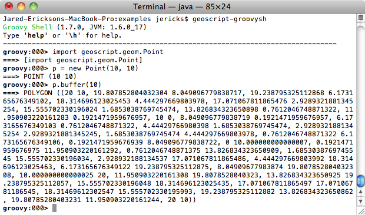
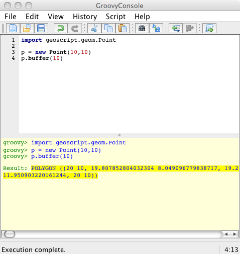

.. _usage:

Using GeoScript Groovy
======================

geoscript-groovy
----------------

The geoscript-groovy command can run scripts saved as files.

geoscript-groovysh
------------------

The geoscript-groovysh command starts an interactive shell.

geoscript-groovyConsole
-----------------------

The geoscript-groovyConsole command runs a desktop application or mini ide.
You can create, edit, save, and run scripts.

